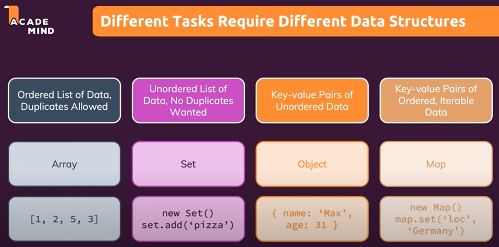
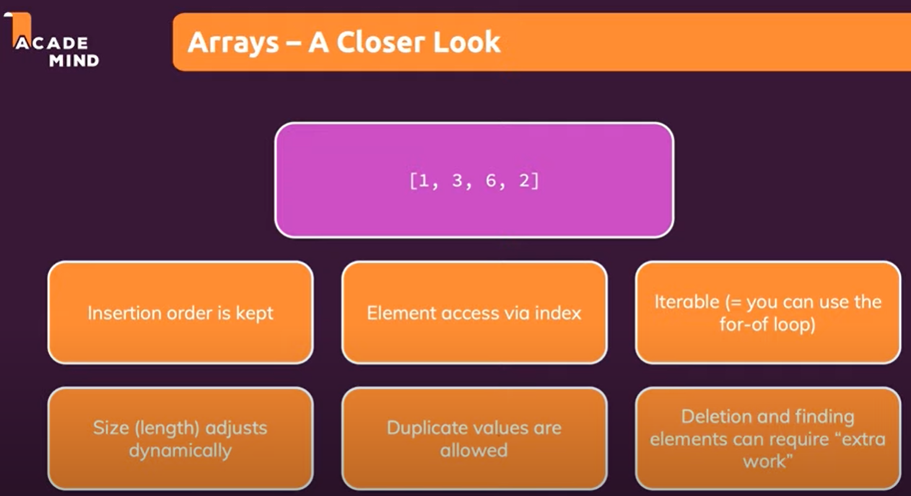
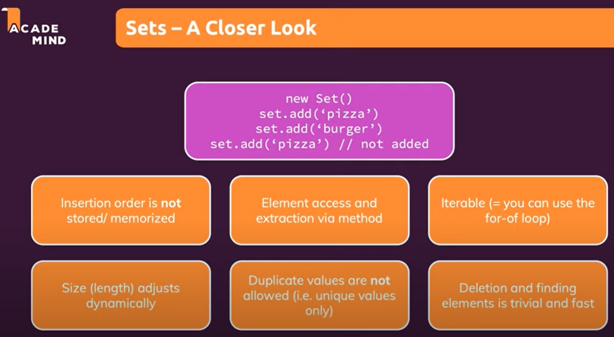
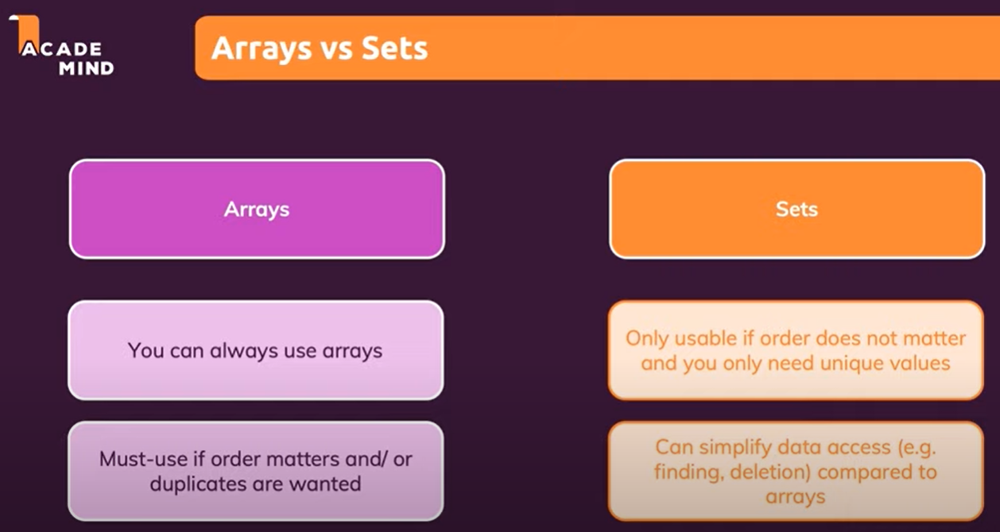
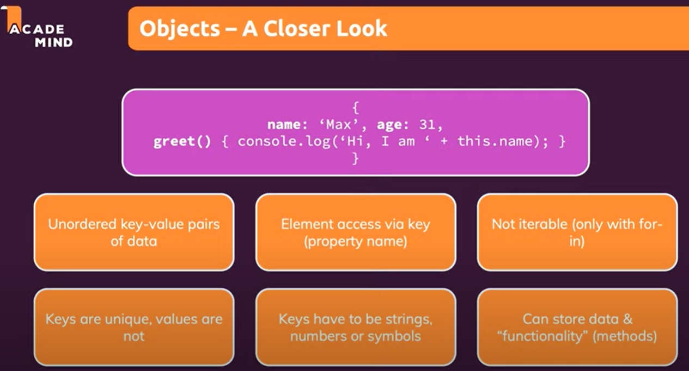
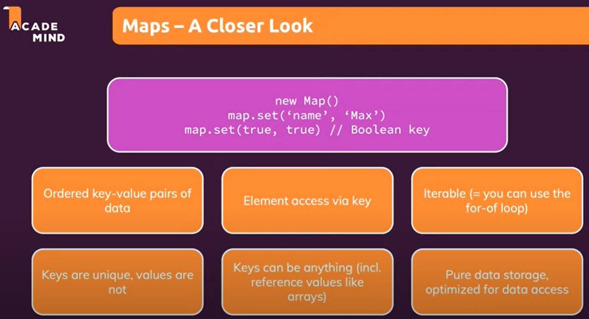
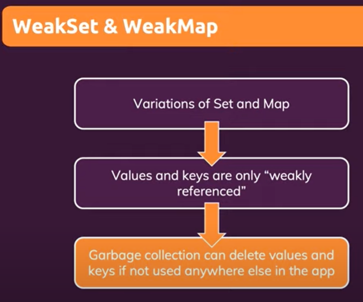
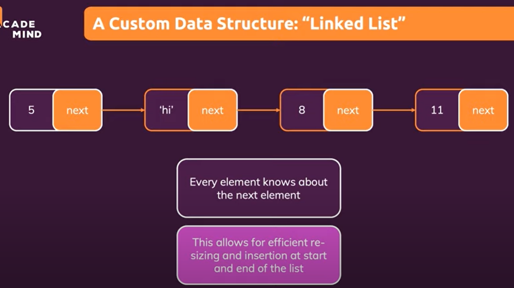
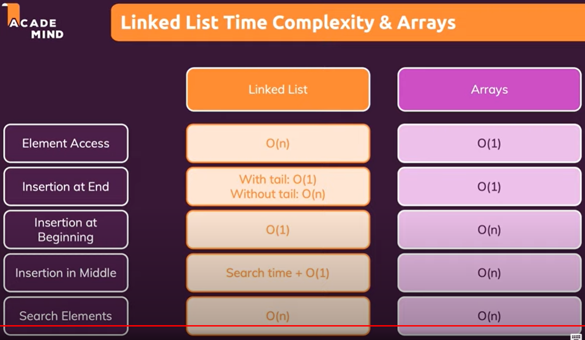

# MyJavaScript

My JavaScript











not iterable, only for-in!











## Fetch API & AXIOS

[Fetch API & AXIOS](FetchAPI_Axios.md)

## If Else Hello World

```js
if (console.log('hello ', '') !== undefined) {
  console.log('hello ');
} else {
  console.log('world');
}
```
