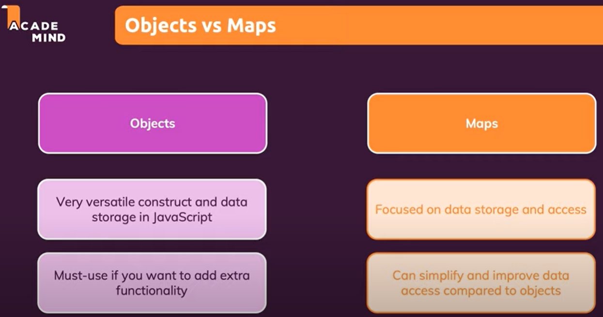
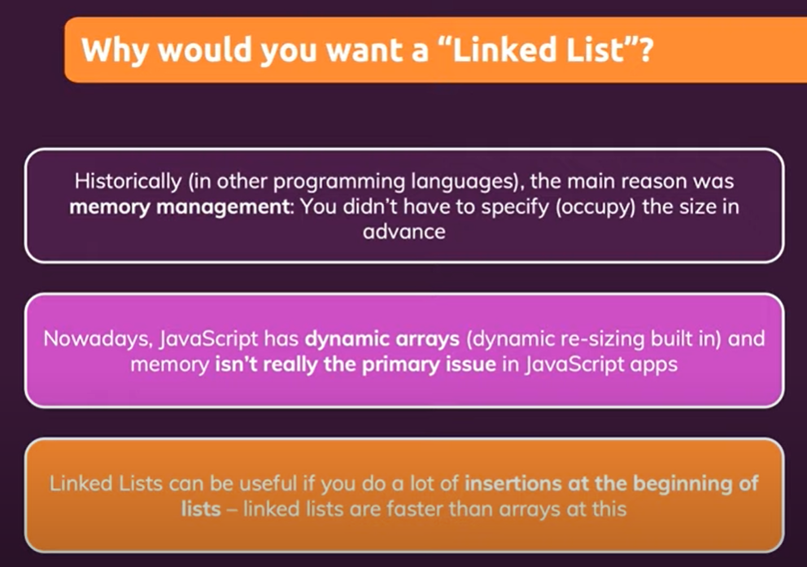

# MyJavaScript

My JavaScript

not iterable, only for-in!

## Fetch API

The Fetch API provides an interface for fetching resources (including across the network). It will seem familiar to anyone who has used XMLHttpRequest, but the new API provides a more powerful and flexible feature set.

Differences from jQuery

The fetch specification differs from jQuery.ajax() in three main ways:

- The Promise returned from fetch() won't reject on HTTP error status even if the response is an HTTP 404 or 500. Instead, it will resolve normally (with ok status set to false), and it will only reject on network failure or if anything prevented the request from completing.

- fetch() won't send cross-origin cookies unless you set the credentials init option (to include).

## Axios

## Fetach API -> Axios

